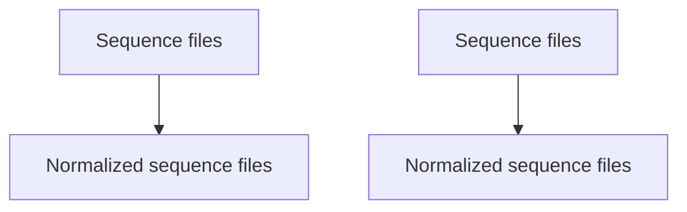

# Nextflow pipeline for normalizing fastq reads

This is nextflow wrapper to run bbmap.sh.  It's inception was to normalize fastq file from monkeypox sequencing.  It could be used for other purposes.

## Input

A folder containing paired end fastq files

## Output

A folder containing depth normalized fastq files.

## Process



## Typical command

```
nextflow run BCCDC-PHL/bbmap-nf --input_fastq [directory containing fastqs] --outdir [directory for output] -profile conda --cache ~/.conda/envs -with-report report.html
```